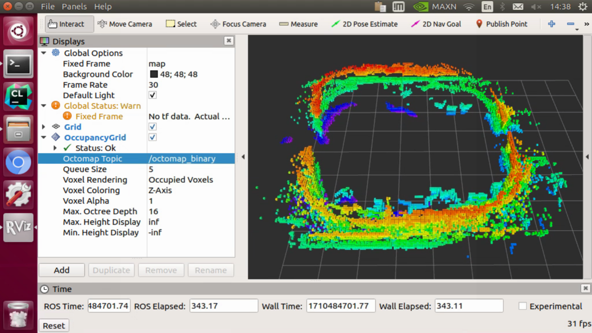

# EasonDrone_Mapping

A ROS package for mapping with LiDAR and D435i.


> RealSense T265 is a tracking camera that is designed to be more optimal for Visual Odometry and SLAM (wider field of view and not using infrared light). It can do SLAM onboard as well as loop closure. However, this camera is not able to return RGB images (since it does not have a RGB camera onboard) and the depth returned is not as good as the D400 series (and can be a little trickier to get).

> Using both a RealSense D435i sensor and a RealSense T265 sensor can provide both the maps and the better quality visual odometry for developing a full SLAM system. The D435i used for the mapping, and the T265 for the tracking.


## Compilation

```bash
catkin_make install --source src/EasonDrone_Mapping --build src/EasonDrone_Mapping/build
```


## octomap

### 建立地图

In real world,

```bash
roslaunch easondrone_mapping experiment.launch
```

In simulator,

```bash
roslaunch easondrone_mapping simulation.launch
```

### 保存地图

> You are trying to invoke `octomap_saver` as an argument to the `octomap_server` node. However, `octomap_saver` is a node of its own, so you only have to start it from a separate terminal while `octomap_server` is running. Check the documentation at http://wiki.ros.org/octomap_server#octomap_saver

控制无人机完成建图后，用以下指令保存.bt（相较于.ot体积更小）格式的地图文件，默认保存到~/下，

```bash
rosrun octomap_server octomap_saver -f map.bt
```


参考：
- https://octomap.github.io/octomap/doc
- ⭐️ https://wiki.ros.org/octomap
- ⭐️ https://github.com/OctoMap/octomap_mapping/blob/kinetic-devel/octomap_server/src/OctomapServer.cpp
- ⭐️ https://groups.google.com/g/octomap/c/ZyfNzcuGlY0?pli=1


### 查看地图

#### 方法1：rviz

一种方法是在`rviz`中查看，

```bash
rosrun rviz rviz
rosrun octomap_server octomap_server_node map.bt
```

添加`OccupancyGrid`，话题选择`/octomap_binary`，



参考：
- [在ROS中将点云（PointCloud2）生成Octomap，rviz可视化显示](https://blog.csdn.net/qq_41816368/article/details/133929136)
- ⭐️ [octomap in rviz and occupancy grids in 3D maps](https://robotics.stackexchange.com/questions/41362/octomap-in-rviz-and-occupancy-grids-in-3d-maps)

#### 方法2：octovis

也可以借助`octovis`工具查看，

```bash
octovis map.bt
```


### 加载地图

参考：
- ⭐ [how to use octomap_server?](https://answers.ros.org/question/361841/how-to-use-octomap_server/)
- ⭐ [OctoMap/octomap_mapping](https://github.com/OctoMap/octomap_mapping/blob/kinetic-devel/octomap_server/launch/octomap_tracking_server.launch)


## Cartographer

> Cartographer is a system that provides real-time simultaneous localization and mapping (SLAM) in 2D and 3D across multiple platforms and sensor configurations.

开始建图

```bash
roslaunch cartographer_ros ~/cartographer_ws/src/cartographer_ros/cartographer_ros/launch/demo_backpack_3d.launch
```

结束建图

```bash
rosservice call /finish_trajectory 0
rosservice call /write_state "{filename: '~/map.pbstream'}"
```


参考：
- ⭐[手把手教你编译cartographer](https://www.bilibili.com/video/BV19P4y1X7Hj)
- [Cartographer ROS Integration](https://google-cartographer-ros.readthedocs.io/en/latest/)
- [cartographer-project/cartographer_ros](https://github.com/cartographer-project/cartographer_ros)


## rtabmap

**NOTICE**: Installation of `rtabmap` is required for using this launch file

<!--
```bash
sudo apt-get install ros-melodic-rtabmap*
```
-->

```bash
roslaunch realsense2_camera rs_rtabmap.launch
```

`rtabmap`涉及到RGB-D

参考：
- [Introduction to Intel® RealSense™ Visual SLAM and the T265 Tracking Camera](https://dev.intelrealsense.com/docs/intel-realsensetm-visual-slam-and-the-t265-tracking-camera)
- [Intel RealSense 3D Camera for Robotics & SLAM (with code)](https://www.robotsforroboticists.com/realsense-usage-robotics-slam/)
- [SLAM模块(Prometheus/Modules/slam)](https://docs.amovlab.com/prometheuswiki/#/src/P450%E4%BD%BF%E7%94%A8%E6%89%8B%E5%86%8C/%E8%BD%AF%E4%BB%B6%E4%BB%8B%E7%BB%8D?id=slam%e6%a8%a1%e5%9d%97prometheusmodulesslam-)


## Release Note

- v2.1.2: import `message_filters::sync_policies::ApproximateTime` for merge
- v2.1.1: publish pose
- v2.1.0: merge `PointCloud2` from several sources, with `frame_id = "base_link"`


## Acknowledgement

Thanks to following packages:

- [global_planning](https://github.com/amov-lab/Prometheus/tree/v1.1/Modules/planning/global_planning)
